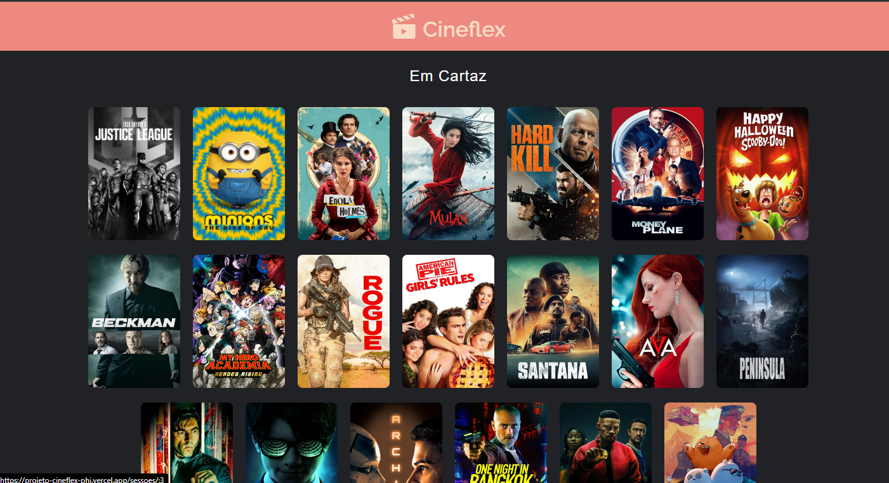
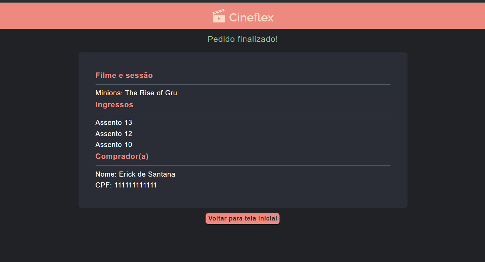

# CineFlex

Um aplicativo para os cinemas feito com React.
## https://projeto-cineflex-phi.vercel.app/

## Screenshots






## Funcionalidades

- Selecione um filme
- Escolha sua seção
- Escolha seu assento
- Concluído!

## Rodando localmente

Clone o projeto

```bash
  git clone https://github.com/erickdesant/projeto-cineflex
```

Entre no diretório do projeto

```bash
  cd my-project
```

Instale as dependências

```bash
  npm install
```

Inicie o servidor

```bash
  npm run dev
```

